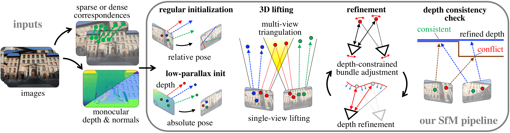

<p align="center">
  <h1 align="center"><ins>MP-SfM</ins> 🏗️<br>Monocular Surface Priors for Robust Structure-from-Motion</h1>
  <p align="center">
    <a href="https://www.linkedin.com/in/zador-pataki-a297b5196/">Zador&nbsp;Pataki</a>
    ·
    <a href="https://psarlin.com/">Paul-Edouard&nbsp;Sarlin</a>
    ·
    <a href="https://demuc.de/">Johannes&nbsp;Schönberger</a>
    ·
    <a href="https://www.microsoft.com/en-us/research/people/mapoll/">Marc&nbsp;Pollefeys</a>
  </p>
  <h2 align="center">
    <p>CVPR 2025</p>
    <a href="https://arxiv.org/pdf/2504.20040" align="center">Paper</a> 
    <!-- |  -->
    <!-- <a href="missing" align="center">Demo 🤗</a> |  -->
    <!-- <a href="missing" align="center">Colab</a> | -->
    <!-- <a href="missing" align="center">Video</a> -->
  </h2>
  
<!-- </p>
<p align="center">
    <a href=""></a> 
    <br>
    <em>
        
    </em>
</p> -->
<p align="center">
    <a href=""></a> 
    <br>
    <em>
        MP-SfM augments Structure-from-Motion with monocular depth and normal priors for reliable 3D reconstruction despite extreme viewpoint changes with little visual overlap.
    </em>
</p>


##

MP-SfM is a Structure-from-Motion pipeline that integrates monocular depth and normal predictions into classical multi-view reconstruction. This hybrid approach improves robustness in difficult scenarios such as low parallax, high symmetry, and sparse viewpoints, while maintaining strong performance in standard conditions. This repository includes code, pretrained models, and instructions for reproducing our results.

## Quick Start
- 🔧 [Setup](#setup) — Install dependencies and prepare the environment.
- 🚀 [Run the Demo](#execution) — Try the full MP-SfM pipeline on example data.
- 🛠️ [Pipeline Configurations](#pipeline-configurations) — Customize your pipeline with OmegaConf configs.
- 📈 [Extending MP-SfM: Use Your Own Priors](#extending-mp-sfm-use-your-own-priors) — Integrate your own depth, normal, or matching modules.

# Setup

<!-- [](missing) -->

We provide the Python package [`mpsfm`](mpsfm). First clone the repository and install the dependencies.

```bash
git clone --recursive https://github.com/cvg/mpsfm && cd mpsfm
```

Build [pyceres](https://github.com/cvg/pyceres) and pycolmap (from [our fork](https://github.com/Zador-Pataki/colmap/tree/clean-update)) from source, then install the required packages:


```bash
pip install -r requirements.txt
python -m pip install -e .
```

<details>
<summary><b>[Optional - click to expand]</b></summary>

- For faster inference with the transformer-based models, install [xformers](https://github.com/facebookresearch/xformers)

- For faster inference with the MASt3R matcher, compile the cuda kernels for RoPE as recommended by the authors:

  ```bash
  DIR=$PWD
  cd third_party/mast3r/dust3r/croco/models/curope/
  python setup.py build_ext --inplace
  cd $DIR
  ```

</details>


# Execution
Our [demo notebook](demo.ipynb) demonstrates a minimal usage example. It shows how to run the MP-SfM pipeline, and how to visualize the reconstruction with its multiple output modalities.
<p align="center">
    <a href=""></a> 
    <br>
    <em>
        Visualizing MP-SfM sparse and dense reconstruction outputs in the demo.
    </em>
</p>


Alternatively, run the reconstruction from the command line:
```bash
# Use default ⚙️
python reconstruct.py \
    --conf sp-lg_m3dv2 \ # see config dir "configs" for other curated options
    --data_dir local/example \ # hosts sfm inputs and outputs when other options aren't specified 
    --intrinsics_path local/example/intrinsics.yaml \ # path to the intrinsics file 
    --images_dir local/example/images \ # images directory
    --cache_dir local/example/cache_dir \ # extraction outputs: depths, normals, matches, etc.
    --extract \ # use ["sky", "features", "matches", "depth", "normals"] to force re-extract
    --verbose 0 

# Or simply run this and let argparse take care of the default inputs
python reconstruct.py 
```
The script will reconstruct the scene in [local/example](local/example), and output the reconstruction into [local/example/sfm_outputs](local/example/sfm_outputs).
- **Extraction**: Some [configurations](configs/sp-mast3r.yaml) only cache a subset of prior outputs, for example [only normals of Metric3Dv2](mpsfm/extraction/imagewise/geometry/models/configs/metric3dv2-normals.yaml). Re-extract using ```--extract``` when later using a prior pipeline that requires all outputs.

- **Verbosity**: Change the verbosity level of the pipeline using ```--verbose```. ```0``` provides clean output. ```1``` offers minimal debugging output, including function benchmarking and a 3D visualization (```3d.html```) saved in your ```--data_dir``` at the end of the process. ```2``` saves a visualization after every 5 registered images, pauses the pipeline, and provides additional debugging outputs. ```3``` provides full debugging outputs.

<details>
<summary><b>[Run with your own data - click to expand]</b></summary>

Check out our example [data directory](local/example). 
- **Images**: Add your images to a single folder. Add them to a folder called "[images](local/example/images)" in the ```--data_dir```, or point to it via ```--images_dir```
- **Camera Intrinsics**: Create a single```.yaml``` file storing all camera intrinsics. Place it in your ```--data_dir``` and call it ```intrinsics.yaml``` or point to it via ```--intrinsics_path```. Follow the structure presented in [intrinsics.yaml](local/example/intrinsics.yaml), or see the description below:
  
  <details>
  <summary><b>[Intrinsics file example - click to expand]</b></summary>

  Single Camera:
  ```yaml
  # .yaml setup when images have shared intrinsics
  1:
    params: [604.32447211, 604.666982, 696.5, 396.5] # fx, fy, cx, cy
    images: all
    # or specify the images belonging to this camera
    # images :
    #   - indoor_DSC03018.JPG
    #   - indoor_DSC03200.JPG
    #   - indoor_DSC03081.JPG
    #   - indoor_DSC03194.JPG
    #   - indoor_DSC03127.JPG
    #   - indoor_DSC03131.JPG
    #   - indoor_DSC03218.JPG
  ```
  Multiple cameras:
  ```yaml
  # .yaml setup when images have different intrinsics
  # camera 1
  1:
    params: [fx1, fy1, cx1, cy1]
    images:
      - im11.jpg
      - im12.jpg
      ...
  # camera 2
  2:
    params: [fx2, fy2, cx2, cy2]
    images:
      - im21.jpg
      - im22.jpg
      ...
  ```
  
  </details>

</details>

# Pipeline configurations
<p align="center">
    <a href=""></a> 
    <br>
    <em>
        We extend COLMAP’s incremental mapping pipeline with monocular priors for which we provide easily adjustable hyperparameters via configs.
    </em>
</p>

We have fine-grained control over all hyperparameters via [OmegaConf](https://omegaconf.readthedocs.io/en/2.3_branch/) configurations, which have sensible default values defined in `MpsfmMapper.default_conf`. Run this python script to display a human-readable overview of all possible adjustable parameters. Note: We import all default COLMAP hyperparameters, but only use a subset.
```python
from mpsfm.sfm.mapper import MpsfmMapper
from mpsfm.utils.tools import summarize_cfg

print(summarize_cfg(MpsfmMapper.default_conf))
```
See our [configuration directory](configs) for all of our carefully selected configuration setups. Each `.yaml` file overwrites default configurations, with the exception of the empty default setup `sp-lg_m3dv2`. Additionally, other configuration setups can be imported using `defaults:` (see [example](configs/sp-mast3r-dense.yaml)). This is **important** because the hyperparameters in some configuration setups (see [defaults](configs/defaults)) were carefully grouped. 

Here, we provide an [example](configs/example.yaml) configuration file detailing all of the important configurations.
<details>
<summary><b>[Click to expand]</b></summary>

```yaml
# Untested config created to demonstrate how to write config files

# import default configs to make sure depth estimators are used with correct uncertainties
defaults: 
  - defaults/depthpro # in this example we use depthpro

reconstruction:
  image:
    depth:
      depth_uncertainty: 0.2 # we can override the default uncertainty in defaults/depthpro.yaml (not recommended)
    normals: 
      flip_consistency: true # use flip consistency check for normals (see defaults in mpsfm/sfm/scene/image/normals.py)

extractors:
  # use dsine normals instead of metric3dv2 (default set in mpsfm/extraction/base.py)
  # use "-fc" variant because we need flipped estimates for the "flip_consistency" check
  normals: DSINE-kappa-fc 
  matcher: roma_outdoor #change matcher
# for dense matchers we can use any combination of sparse and dense by combining with "+"
# for mast3r, you can additionally set "depth", e.g. "sparse+dense+depth"
matches_mode: dense


# change high level mapper logic:
depth_consistency: false # removes depth consistency check
integrate: false # disables depth optimization 
int_covs: true # enables optimized depth map uncertainty prop.

# more advanced mapper options
triangulator:
  # avoids introducing 3D points with large errors (during retriangulation) for images that observe 
  # less than 120 3D points with track length<2 (defaults in mpsfm/sfm/mapper/triangulator.py)
  nsafe_threshold: 120 
  colmap_options:
    min_angle: 0.1 # increase minimum triangulation angle from default (defaults in mpsfm/sfm/mapper/triangulator.py)
```

</details>

## Our favorite configurations

- [sp-lg_m3dv2](configs/sp-lg_m3dv2.yaml) ⚡️ (default): Fastest reconstruction with very precise camera poses. Failure cases only in scenes with little texture or very challenging viewpoint changes
- [sp-sp-mast3r](configs/sp-mast3r.yaml) 💪: Robust reconstruction even in egregious viewpoint changes and very low overlap. Thanks to anchoring matches around Superpoint keypoints, reconstruction is also precise. 
- [sp-sp-mast3r-dense](configs/sp-mast3r-dense.yaml) 💪: Like above, however also leverages dense correspondences in non-salient regions. As a result, this configuration is capable of reconstructing scenes in the most challenging setups: very low-overlap + low texture + egregious view point changes (e.g. opposing views). This, however, comes at the cost of precision. 
- [sp-roma-dense_m3dv2](configs/sp-roma-dense_m3dv2.yaml) 🏋️: In the absence of egregious viewpoint changes, this is our most accurate pipeline, however, also the most expensive. 

Below, we detail the benefits of the key priors we recommend, in case the user wants to mix the configurations.  

## Selecting your Matcher
Check out the available [feature extraction](mpsfm/extraction/imagewise/features/models/configs) and [matching](mpsfm/extraction/pairwise/models/configs) configurations. 
Our default pipeline is built on top of [Superpoint](mpsfm/extraction/imagewise/features/models/configs/superpoint.yaml)+[LightGlue](mpsfm/extraction/pairwise/models/configs/superpoint+lightglue.yaml). However, using additional computational resources, we can get improved accuracies on low overlap scenes using dense matchers. Our pipeline supports three matching modes (`sparse`, `dense`, `sparse+dense`). See our [demo](demo.ipynb) for more details.

<details>
<summary><b>[Configuration Recommendations - click to expand]</b></summary>

We recommend using `sparse` or `sparse+dense`: 
- [Superpoint](mpsfm/extraction/imagewise/features/models/configs/superpoint.yaml)+[LightGlue](mpsfm/extraction/pairwise/models/configs/superpoint+lightglue.yaml): **Fast** ⚡️ and **precise**, however struggles under harsh viewpoint changes. 
- [MASt3r](mpsfm/extraction/pairwise/models/configs/mats3r.yaml)
  - `sparse`: **Robust** 💪 against egregious viewpoint changes (like opposing views) and also **precise** thanks to [Superpoint](mpsfm/extraction/imagewise/features/models/configs/superpoint_lightglue.yaml) keypoints, with a moderate extraction speed. 
  - `sparse+dense`: **Robust** 💪 even in featureless environments, however, precision and extraction speed drops. 
- [RoMA](mpsfm/extraction/pairwise/models/configs/roma_outdoor.yaml)
  - `sparse+dense`: **Best performance** 💥 in low overlap scenarios without symmetries and difficult viewpoint changes, however resource intensive, cannot match egregious viewpoint changes and struggles to reject negative pairs (symmetry issues)
  - ~~`sparse`~~: Good performance, however sampling sparse matches from RoMA doubles the extraction time. Better to use `dense` in challenging scenarios or a faster matcher

</details>

## Selecting your Monocular Surface Priors
Our leverages [depth and normal estimators](mpsfm/extraction/imagewise/geometry/models/configs)  and their corresponding uncertainties. We carefully calibrated uncertainties per depth estimator. We found that uncertainties estimated by the network (where applicable) and modeling uncertainties proportional to the depth estimates was reliable (see [per-estimator setups](configs/defaults)).

<details>
<summary><b>[Configuration Recommendations - click to expand]</b></summary>

### Depth Estimators
- Metric3Dv2:
  - [Giant2](mpsfm/extraction/imagewise/geometry/models/configs/metric3dv2.yaml) (our default): Great generalizable estimates 💥, at the cost of extraction speed and GPU memory
  - [Large](mpsfm/extraction/imagewise/geometry/models/configs/metric3dv2-large.yaml) maintains performance against  Giant 💪 in many scenarios while significantly improving extraction speed. [Small](mpsfm/extraction/imagewise/geometry/models/configs/metric3dv2-small.yaml) provides very fast ⚡️ extraction, and performs sufficiently well in easy scenarios
- [DepthPro](mpsfm/extraction/imagewise/geometry/models/configs/depthpro.yaml): Competes with Metric3Dv2-Giant2 in depth quality 💪; however, with similarly large extraction times and is limited by a lack of predicted uncertainties
- [DepthAnythingV2](mpsfm/extraction/imagewise/geometry/models/configs/depthanythingv2-outdoor.yaml): Reasonable performance in small scale environments
- [MASt3R](mpsfm/extraction/pairwise/models/configs/mats3r.yaml): estimates depth maps using two input views. As a result, achieves the best performance 💥 at extracting relative scales between background and foreground objects; critical in some low-overlap scenarios

### Normal Estimators
- Metric3Dv2:
  - [Giant2](mpsfm/extraction/imagewise/geometry/models/configs/metric3dv2.yaml) (our default): Our best performing normal extractor 💥. However, introduces a considerable overhead when used in combination with a different depth estimator
  - [Small](mpsfm/extraction/imagewise/geometry/models/configs/metric3dv2-small.yaml) & [Large](mpsfm/extraction/imagewise/geometry/models/configs/metric3dv2-large.yaml) improves extraction speeds, however, their quality is largely under explored
- [DSINE](mpsfm/extraction/imagewise/geometry/models/configs/DSINE-kappa.yaml): fastest ⚡️ extraction times, however, with a drop in generalizability

</details>

# Extending MP-SfM: Use Your Own Priors

Our extractors follow the [hloc](https://github.com/cvg/Hierarchical-Localization) format. Thus, MP-SfM can easily be extended with improvements in monocular surface estimators with minimal effort. Monocular surface prior improvements (surface and uncertainty predictions) will facilitate more robust reconstruction qualities in the most challenging scenarios. Moreover, the pipeline could greatly benefit from improved matchers capable of rejecting negative pairs.

<details>
<summary><b>[Configuration Recommendations - click to expand]</b></summary>

### Sparse Matchers

- We [extract](mpsfm/extraction/imagewise/features/base.py) and [match sparse features](mpsfm/extraction/pairwise/match_sparse.py) using hloc modules (see [feature configs](mpsfm/extraction/imagewise/features/models/configs) and [matcher configs](mpsfm/extraction/pairwise/models/configs))
- Follow the structure presented in [superpoint](mpsfm/extraction/imagewise/features/models/superpoint.py) to add your own matcher
- Follow the structure presented in [lightglue](mpsfm/extraction/pairwise/models/lightglue.py) to add your own matcher


### Dense matchers

- Our [dense matching framework](mpsfm/extraction/pairwise/match_dense_2view.py) with accompanying [config files](mpsfm/extraction/pairwise/models/configs) can match both [salient features](mpsfm/extraction/imagewise/features/base.py) and sample matches on featureless regions. 
- We support two types of dense feature matchers. Both of which interpolate predictions around salient features to match them. Follow the corresponding structures:
  - [Feature map pair](mpsfm/extraction/pairwise/models/mast3r_all.py) ([utils](mpsfm/extraction/pairwise/models/utils/featuremap.py)): Networks output feature maps per image, and sample matches through a nearest neighbors search 
  - [Warp](mpsfm/extraction/pairwise/models/roma.py) ([utils](mpsfm/extraction/pairwise/models/utils/warp.py)): Networks directly predict pixelwise correspondences

### Monocular Surface Priors

- See our [monocular prior extraction framework](mpsfm/extraction/imagewise/geometry/base.py) and its accompanying [config files](mpsfm/extraction/imagewise/geometry/models/configs)
- For predicting both depth and normals, follow [this](mpsfm/extraction/imagewise/geometry/models/depth/metric3dv2.py) class structure
- Our pipeline relies on monocular prior uncertainties which require calibration. Check out the different uncertainty representations [`prior_uncertainty`, `flip_consistency`, `depth_uncertainty`] in the [Depth Object](mpsfm/sfm/scene/image/depth.py) and similarly [`prior_uncertainty`, `flip_consistency`] in the [Normals Object](mpsfm/sfm/scene/image/normals.py)
- For leveraging `flip_consistency`, the model must extract two sets of priors per image (see [config](mpsfm/extraction/imagewise/geometry/models/configs/metric3dv2-nfc.yaml)). This, however, doubles the extraction time and storage requirements
- If your matcher also extracts depth maps, follow [this](mpsfm/extraction/pairwise/models/mast3r_all.py) class structure

</details>

## BibTeX citation

If you use any ideas from the paper or code from this repo, please consider citing:

```bibtex
@inproceedings{pataki2025mpsfm,
  author    = {Zador Pataki and
               Paul-Edouard Sarlin and
               Johannes L. Sch\"onberger and
               Marc Pollefeys},
  title     = {{MP-SfM: Monocular Surface Priors for Robust Structure-from-Motion}},
  booktitle = {CVPR},
  year      = {2025}
}
```
